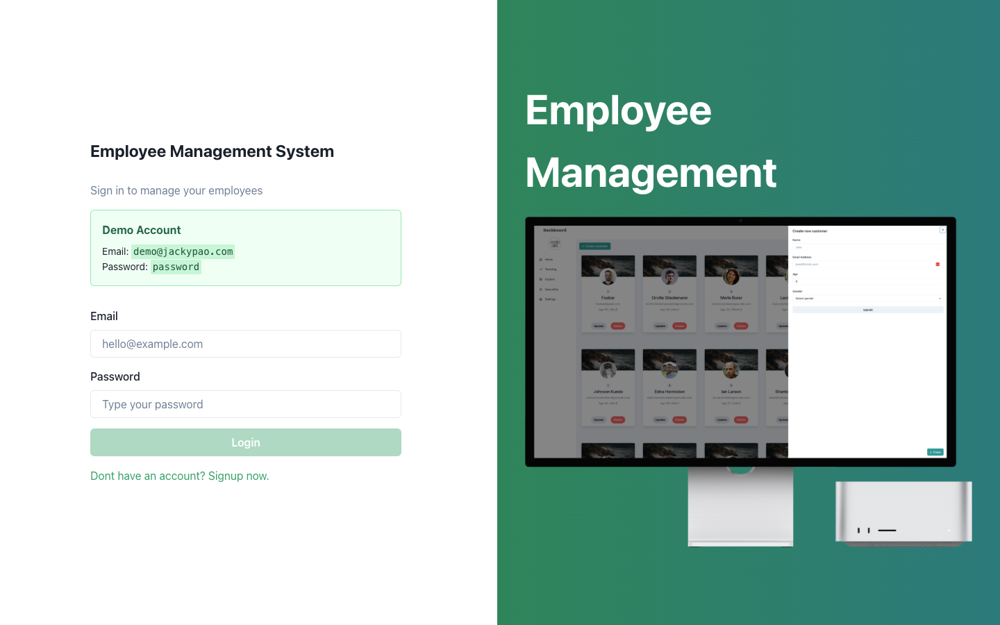
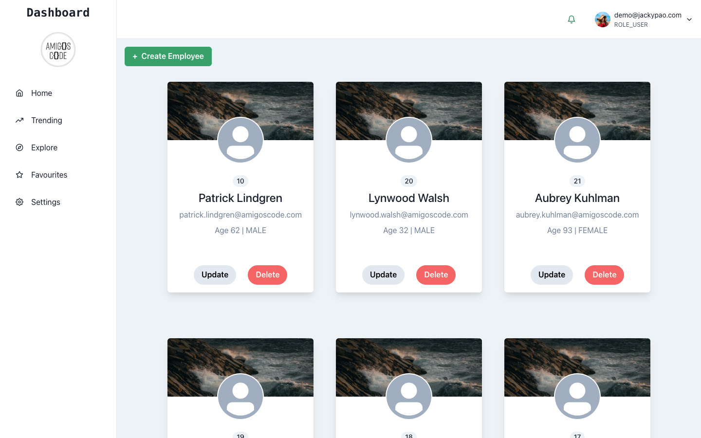

# 員工管理系統

這是一個全端員工管理系統，使用 Spring Boot、React 和 PostgreSQL 建置，並部署在 AWS 上（Elastic Beanstalk + Amplify + S3 + CloudFront）。

> 本專案以 [Amigoscode Spring Boot Fullstack course](https://www.amigoscode.com) 為基礎，後續延伸加入 CI/CD 流程、AWS 雲端部署，以及實際部署時遇到的正式環境問題修復。

## 線上展示

🔗 https://main.d1zjxnolctj65r.amplifyapp.com

> 備註：為了控制 AWS 成本，後端服務平時可能不會持續啟動；若 Demo 無法操作，可能是後端暫時關閉。

**Demo 帳號**
- Email：`demo@jackypao.com`
- Password：`password`

## 畫面截圖




## 技術棧

**後端**
- Java 17 + Spring Boot 3.4
- Spring Security 6（以 JWT 為基礎的身分驗證）
- Spring Data JPA + JDBC
- PostgreSQL
- Flyway（資料庫 migration）
- AWS S3（員工大頭照儲存）
- Docker + AWS Elastic Beanstalk

**前端**
- React 18 + TypeScript + Vite
- Chakra UI
- Formik + Yup（表單驗證）
- React Router v6
- AWS Amplify + CloudFront

## 功能

- 員工 CRUD 操作（新增、查詢、更新、刪除）
- JWT 身分驗證與授權
- 透過 AWS S3 上傳員工大頭照
- 響應式 UI，使用綠色系主題
- 使用 GitHub Actions 建立 CI/CD 流程

## API 端點

| Method | Path | 說明 |
|--------|------|-------------|
| GET | `/api/v1/employees` | 取得所有員工 |
| GET | `/api/v1/employees/{id}` | 依 ID 取得員工 |
| POST | `/api/v1/employees` | 建立新員工 |
| PUT | `/api/v1/employees/{id}` | 更新員工資料 |
| DELETE | `/api/v1/employees/{id}` | 刪除員工 |
| POST | `/api/v1/employees/{id}/profile-image` | 上傳員工大頭照 |
| GET | `/api/v1/employees/{id}/profile-image` | 取得員工大頭照 |
| POST | `/api/v1/auth/login` | 登入 |

## 快速開始

### 前置需求
- Java 17+
- Node.js 18+
- Docker + Docker Compose
- Maven

### 本機執行

啟動資料庫：
```bash
docker compose up -d
```

啟動後端：
```bash
cd backend
mvn spring-boot:run
```

啟動前端：
```bash
cd frontend/react
npm install
npm run dev
```
